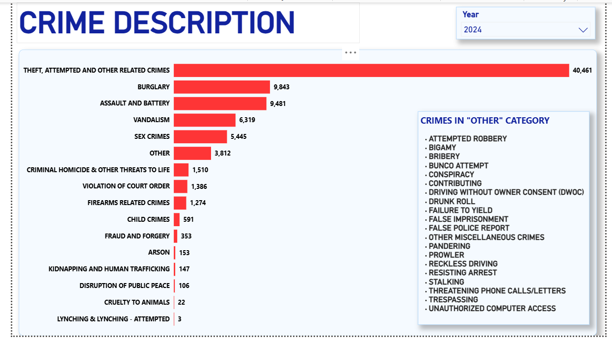
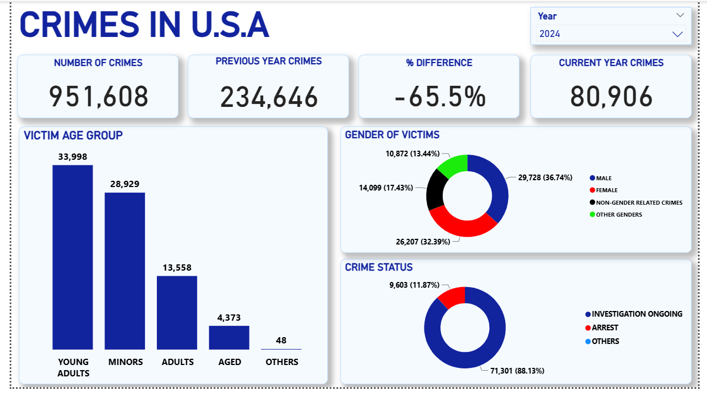

# Crimes in U.S.A Dashboard – Power BI

## Project Overview
This project is an **interactive crime analyses dashboard** created using **Power BI**.  
It is essential for understanding trends and patterns in criminal activity. This dashboard is valuable 
for law enforcement agencies, policymakers, researchers, and the public to make informed decisions about crime prevention and intervention strategies.

---

## Tools & Technologies
- **Power BI Desktop** – Data modeling, DAX calculations, and dashboard creation
- **Excel** – Initial data cleaning and preparation
- **DAX** – Measures and calculated columns
- **Power Query** – Data transformation

---

## Project Files
- `Crimes in USA from 2020.pbix` – Main Power BI file
- `README.md` – Project documentation
## Dataset
The dataset used in this project can be accessed here:  
[Download Dataset](https://www.kaggle.com/datasets/qnqfbqfqo/crime-data-from-2020-to-present?resource=download)

---

## Dashboard Features
- **Crime figures** – Yearly analysis
- **Top Crimes** – Highest kind of crimes
- **Area Performance** – Tabular display of crimes by areas
- **KPI Tracking** – Crime rate, previous crimes, growth rate
- **Filters & Slicers** – Interactive filtering by date

---

## Dashboard Preview
 
  
  

---

## How to Use
1. **Download the `.pbix` file** from this repository.
2. Open in **Power BI Desktop**.
3. Open the link to the dataset provided
---

## Insights Generated
- Identified **crime rate by area** for crime prevention strategies.
- Found **crime rate overtime** for showing how preventive measures have been working.
- Highlighted **crimes by frequency** for further investigation why repeated crimes keep occuring
- Shows **the rate of closed cases** 

---

## Author
**Udemeabasi Ekong**  
[udemeabasi6@gmail.com]  
[www.linkedin.com/in/udemeabasi-ekong-973344157]

---
